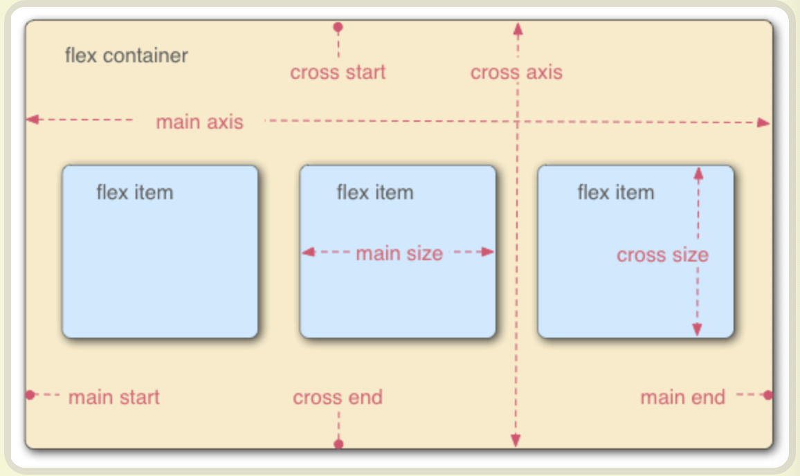
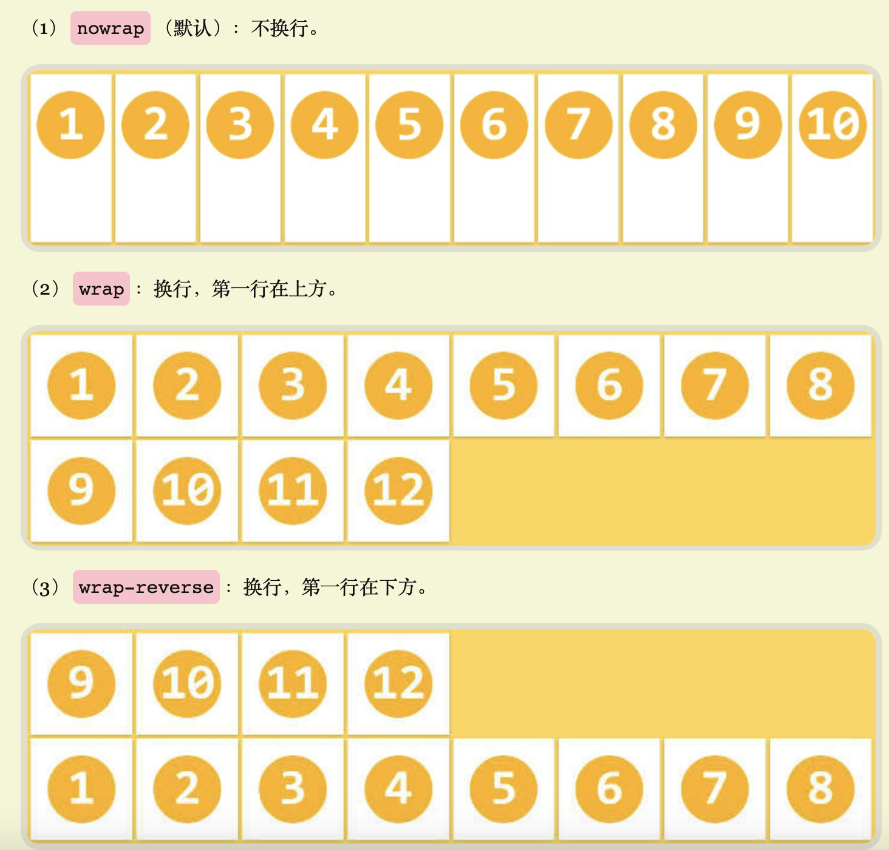
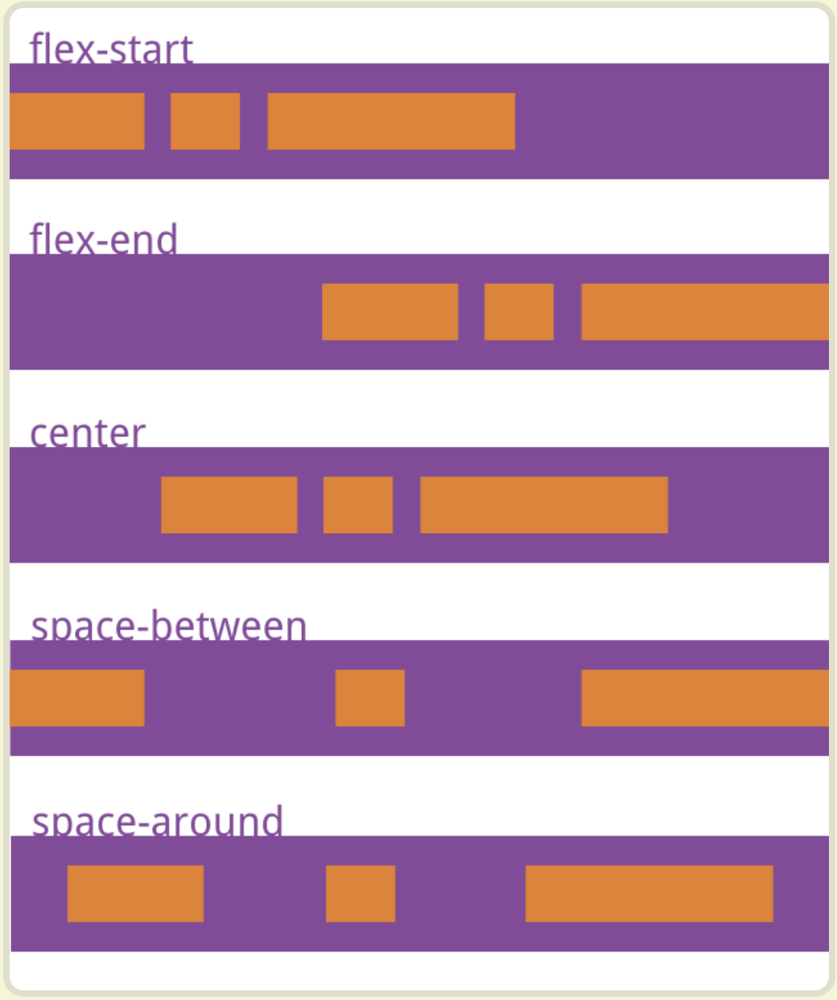
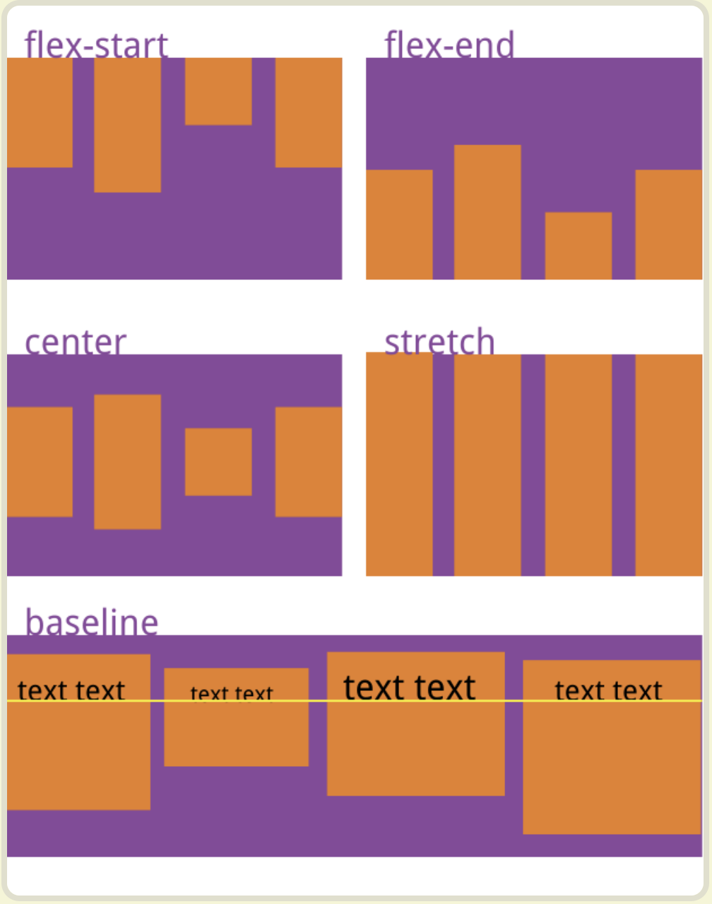
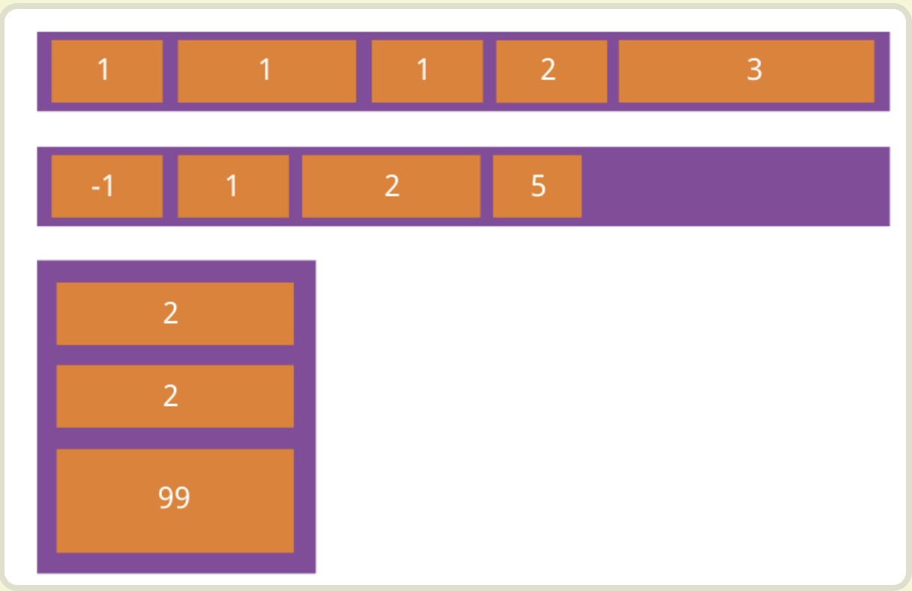
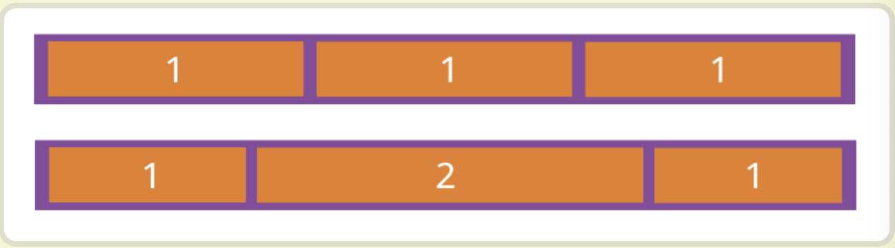

### Flex 布局

> flex 如何实现一个布局使子元素一个左上一个右下

首先先看 flex

为什么要用 flex 布局？

因为传统布局基于[盒状模型](https://developer.mozilla.org/en-US/docs/Web/CSS/box_model)，依赖 [`display`](https://developer.mozilla.org/en-US/docs/Web/CSS/display) 属性 + [`position`](https://developer.mozilla.org/en-US/docs/Web/CSS/position)属性 + [`float`](https://developer.mozilla.org/en-US/docs/Web/CSS/float)属性。它对于那些==特殊布局==非常不方便，比如，**垂直居中**就不容易实现。([16 种方法实现水平居中垂直居中](https://juejin.im/post/6844903474879004680))

flex 可以做到**简便**、**完整**、**响应式布局** 而且所有浏览器支持

注意，设为 Flex 布局以后，子元素的==`float`、`clear`和`vertical-align`==属性将失效。

当你将一个盒子布局定义为 flex 时 他就变成了一个**Flex 容器** 他的所有容器成员成为**Flex item**



**容器**(父元素)属性有 6 个

1. flex-direction (决定子元素的排列方向为 水平/垂直 从左/上还是右/下开始 ) 默认: **row** **(水平 左开始)**

2. flex-wrap(决定子元素的换行) 默认 **nowrap** **(不换行)**
3. flex-flow 默认 **row nowrap** **(水平 左开始 不换行)**
4. justufy-content 默认 **flex-start** **(左对齐)**
5. align-items 默认 **flex-start** **(上对齐 交叉轴起点对齐？)**
6. align-content 默认 **flex-start** **(多跟轴线交叉轴起点对齐)**

1.flex-direction

```css
/*
row（默认值）：主轴为水平方向，起点在左端。
row-reverse：主轴为水平方向，起点在右端。
column：主轴为垂直方向，起点在上沿。
column-reverse：主轴为垂直方向，起点在下沿。
*/

.box {
  flex-direction: row | row-reverse | column | column-reverse;
}
```

2.flex-wrap

```css
/*
nowrap（默认）：不换行。
wrap：换行，第一行在上方。
wrap-reverse：换行，第一行在下方。
*/
.box {
  flex-wrap: nowrap | wrap | wrap-reverse;
}
```

默认



Flex-flow 两者集合

```css
/*`flex-flow`属性是`flex-direction`属性和`flex-wrap`属性的简写形式，默认值为`row nowrap`。*/
.box {
  flex-flow: <flex-direction> || <flex-wrap>;
}
```

justify-content 属性 水平方向

```javascript
/*justify-content属性定义了项目在主轴上的对齐方式。
它可能取5个值，具体对齐方式与轴的方向有关。下面假设主轴为从左到右。
flex-start（默认值）：左对齐
flex-end：右对齐
center： 居中
space-between：两端对齐，项目之间的间隔都相等。
space-around：每个项目两侧的间隔相等。所以，项目之间的间隔比项目与边框的间隔大一倍。*/


.box {
  justify-content: flex-start | flex-end | center | space-between | space-around;
}

```



align items 属性 垂直方向

```css
/* 它可能取5个值。具体的对齐方式与交叉轴的方向有关，下面假设交叉轴从上到下。

flex-start：交叉轴的起点对齐。
flex-end：交叉轴的终点对齐。
center：交叉轴的中点对齐。
baseline: 项目的第一行文字的基线对齐。
stretch（默认值）：如果项目未设置高度或设为auto，将占满整个容器的高度。 */
.box {
  align-items: flex-start | flex-end | center | baseline | stretch;
}
```



align-content 属性

```css
/*align-content属性定义了多根轴线的对齐方式。如果项目只有一根轴线，该属性不起作用。
flex-start：与交叉轴的起点对齐。
flex-end：与交叉轴的终点对齐。
center：与交叉轴的中点对齐。
space-between：与交叉轴两端对齐，轴线之间的间隔平均分布。
space-around：每根轴线两侧的间隔都相等。所以，轴线之间的间隔比轴线与边框的间隔大一倍。
stretch（默认值）：轴线占满整个交叉轴。*/
.box {
  align-content: flex-start | flex-end | center | space-between | space-around |
    stretch;
}
```

#### 项目(子元素)的属性

1. order 定义项目的排列顺序 **默认 0**

2. flex-grow 定义项目的放大比例 **默认 0**
3. flex-shrink 定义了项目的缩小比例，**默认 1** 与 flex-shrink 对应
4. flex-basis 定义分配多余空间之前， 项目占据的主轴空间 **默认 auto **即项目的本来大小
5. flex = flex-grow + flex-shrink + flex-basis 集合 **默认 0 1 auto**
6. align-self 允许单个项目有与其他项目不一样的对齐方式 **默认值 auto**

order 定义项目的排列顺序 数值越小 排列越前 默认 0

```css
.item {
  order: <integer>;
}
```



flex-grow 定义项目的放大比例 默认 0 如果有剩余看见也不放大

```css
.item {
  flex-grow: <number>; /* default 0 */
}
```



flex-shrink 定义了项目的缩小比例，默认为 1，即如果空间不足，该项目将缩小。

```css
/*
默认为1/负值无效
如果所有项目的flex-shrink属性都为1，当空间不足时，都将等比例缩小。如果一个项目的flex-shrink属性为0，其他项目都为1，则空间不足时，前者不缩小。

负值对该属性无效。*/
.item {
  flex-shrink: <number>; /* default 1 */
}
```


flex-basis

`flex-basis`属性定义了在分配多余空间之前，项目占据的主轴空间（main size）。浏览器根据这个属性，计算主轴是否有多余空间。它的默认值为`auto`，即项目的本来大小。

```css
.item {
  flex-basis: <length> | auto; /* default auto */
}
```

==不理解==

flex 属性

`flex`属性是`flex-grow`, `flex-shrink` 和 `flex-basis`的简写，默认值为`0 1 auto`。后两个属性可选。

```css
.item {
  flex: none | [ < "flex-grow" > < "flex-shrink" >? || < "flex-basis" > ];
}
```

该属性有两个快捷值：`auto` (`1 1 auto`) 和 none (`0 0 auto`)。

建议优先使用这个属性，而不是单独写三个分离的属性，因为浏览器会推算相关值。

align-self

`align-self`属性允许单个项目有与其他项目不一样的对齐方式，可覆盖`align-items`属性。默认值为`auto`，表示继承父元素的`align-items`属性，如果没有父元素，则等同于`stretch`。

```css
/* 和align-item一个道理 */
.item {
  align-self: auto | flex-start | flex-end | center | baseline | stretch;
}
```
